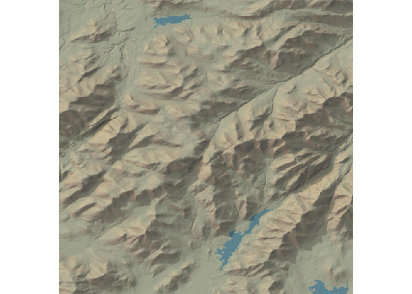
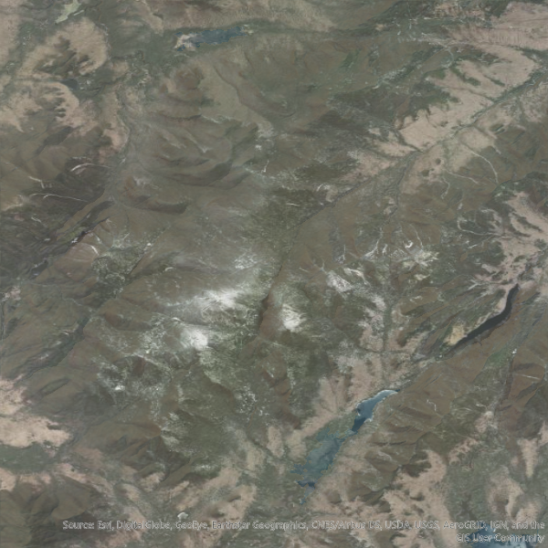
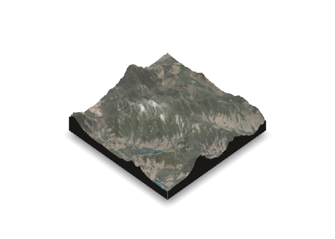

+++
# Project title.
title = "spacey: Obtain Spatial Data and Make Better Maps"

# Date this page was created.
date = 2020-03-24T00:00:00

# Project summary to display on homepage.
summary = "USGS data access and rayshader maps, done cheap."

# Tags: can be used for filtering projects.
# Example: `tags = ["machine-learning", "deep-learning"]`
tags = ["spacey", "R", "R Packages", "maps"]

# Optional external URL for project (replaces project detail page).
external_link = ""

# Featured image
# To use, add an image named `featured.jpg/png` to your project's folder. 
[image]
  # Caption (optional)
  # caption = ""
  
  # Focal point (optional)
  # Options: Smart, Center, TopLeft, Top, TopRight, Left, Right, BottomLeft, Bottom, BottomRight
  focal_point = "Center"  
+++

The `spacey` package provides three main functions to make it easy to
quickly build beautiful maps of locations in the United States via the
[rayshader](https://github.com/tylermorganwall/rayshader) package. First
off, it provides an `automap` function to quickly make maps using data
from the USGS national map:

    library(spacey)
    example_map <- automap(44.121268, -73.903734)
    example_map

As well as letting you incorporate overlay textures from ESRI’s
MapServer API:

    example_map$update_values(overlay = "World_Imagery")
    example_map

And optionally even turn these into 3D visualizations:

    example_map$method <- "3d"
    example_map

All of these can also work with the `future` package to speed up
processing, letting you iterate on your map designs faster:

    library(future)
    plan("sequential")
    tictoc::tic()
    example_map <- automap(44.121268, -73.903734)
    tictoc::toc()

    ## 21.162 sec elapsed

    plan("multisession")
    tictoc::tic()
    example_map <- automap(44.121268, -73.903734)
    tictoc::toc()

    ## 17.864 sec elapsed

And while `automap` tries to make it easy to configure these maps,
`spacey` also lets you save off your heightmaps and overlays directly
through the functions `get_heightmap` and `get_overlay`, so that you can
work directly with `rayshader` to make these maps by yourself.

There’s a lot more to these three functions, alongside a few basic
geospatial utilities `spacey` implements to make it easier to make maps
from your data. For more information, check out the [introductory
vignette](https://mikemahoney218.github.io/spacey/articles/introduction-to-spacey.html)!

You can install the released version of `spacey` from [CRAN](https://CRAN.R-project.org) with:

    install.packages("spacey")

You can always get the most up-to-date development version with:

    # install.packages("remotes")
    remotes::install_github("mikemahoney218/spacey")

You can find more information about this project in the 
[documentation](https://mikemahoney218.github.io/spacey/), or check out the 
code on [GitHub](https://github.com/mikemahoney218/spacey).